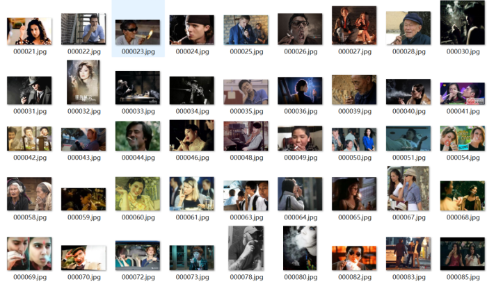
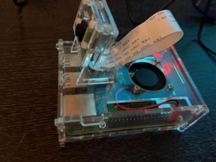

<!-- Improved compatibility of back to top link: See: https://github.com/othneildrew/Best-README-Template/pull/73 -->
<a name="readme-top"></a>
<!--
*** Thanks for checking out the Best-README-Template. If you have a suggestion
*** that would make this better, please fork the repo and create a pull request
*** or simply open an issue with the tag "enhancement".
*** Don't forget to give the project a star!
*** Thanks again! Now go create something AMAZING! :D
-->


<!-- PROJECT SHIELDS -->
<!--
*** I'm using markdown "reference style" links for readability.
*** Reference links are enclosed in brackets [ ] instead of parentheses ( ).
*** See the bottom of this document for the declaration of the reference variables
*** for contributors-url, forks-url, etc. This is an optional, concise syntax you may use.
*** https://www.markdownguide.org/basic-syntax/#reference-style-links
-->
[![Contributors][contributors-shield]][contributors-url]
[![Forks][forks-shield]][forks-url]
[![Stargazers][stars-shield]][stars-url]
[![Issues][issues-shield]][issues-url]
[![MIT License][license-shield]][license-url]
[![LinkedIn][linkedin-shield]][linkedin-url]


<!-- PROJECT LOGO -->
<br />
<div align="center">
<h3 align="center">Intelligent-safe-driving-detection-system</h3>
  <p align="center">
    13th Service Outsourcing Innovation and Entrepreneurship Competition for Chinese College Students
    <br />
    <a href="https://github.com/fqt111/Intelligent-safe-driving-detection-system"><strong>Explore the docs »</strong></a>
    <br />
  </p>
</div>


<!-- TABLE OF CONTENTS -->
<details>
  <summary>Table of Contents</summary>
  <ol>
    <li>
      <a href="#about-the-project">About The Project</a>
      <ul>
        <li><a href="#built-with">Built With</a></li>
      </ul>
    </li>
    <li>
      <a href="#getting-started">Getting Started</a>
      <ul>
        <li><a href="#prerequisites">Prerequisites</a></li>
        <li><a href="#installation">Installation</a></li>
      </ul>
    </li>
    <li><a href="#usage">Usage</a></li>
    <li><a href="#roadmap">Roadmap</a></li>
    <li><a href="#contributing">Contributing</a></li>
    <li><a href="#license">License</a></li>
    <li><a href="#contact">Contact</a></li>
    <li><a href="#acknowledgments">Acknowledgments</a></li>
  </ol>
</details>


<!-- ABOUT THE PROJECT -->
## About The Project
### User demand
1. Drunk Driving Monitoring System: Install an alcohol detection sensor on the steering wheel of the car to determine whether the driver is driving under the influence of alcohol. If detected, automatically dial the driver's family contact.
2. Driver Behavior State Monitoring System: Add a camera in front of the driver, pointing towards their face, to provide real-time monitoring of the driver's behavior state. This includes detecting actions such as closing eyes, yawning, lack of concentration, making phone calls, smoking, etc. The system issues voice warnings accordingly.
3. Develop an intelligent wearable device, utilizing existing mature products, to measure the car owner's vital signs such as body temperature, heart rate, blood pressure, and blood lipid levels.
4. Collect and analyze the gathered information and data. Generate health reports for the user. In case of sudden abnormalities in driving indicators, automatically call the driver's family contact and report real-time location.
<p align="right">(<a href="#readme-top">back to top</a>)</p>

### System introduction

We have developed a comprehensive intelligent safety driving detection system as a part of our project. This system can be deployed in any vehicle and is combined with a portable wearable smart device that enables accurate and effective detection and assessment of the driver's driving behavior. The project has successfully addressed the majority of user requirements and has incorporated additional auxiliary features.
The system processes and analyzes images locally using a Raspberry Pi for the purpose of detecting the driver's state. It utilizes the analysis of actions such as yawning, blinking, and nodding off to determine whether fatigue driving is occurring. Additionally, it detects actions like making phone calls and smoking to assess whether dangerous driving is taking place. A core STM32 microcontroller is deployed on the local end to serve as the central control unit, connecting all in-car system sensors and modules for voice alerts, automatic phone/sms notifications, and more. When the local end identifies drunk driving, it automatically dials the preset emergency contact number, sending alert messages and location details.
Furthermore, we offer a health wristband as a wearable smart device. This wristband can monitor the user's vital signs, including heart rate and other health indicators. To enhance user convenience, we provide a WeChat mini-program as a frontend interface, which connects to the backend server for data storage and retrieval. Through this mini-program, users can easily access their health reports and driving behavior reports.
This comprehensive setup effectively combines image processing on the Raspberry Pi, core control via the STM32 microcontroller, and the convenience of a health wristband and a WeChat mini-program interface, creating a robust solution for driver monitoring and health assessment.
I will focus more on detection algorithms part
<!-- GETTING STARTED -->
## Detection Algorithm
### Fatigue Detection

```python
# Initialize the DLIB's Face detector (HOG) and then create face marker predictions
# Step 1: Use dlib.get_frontal_face_detector() to get a face position detector
detector = dlib.get_frontal_face_detector()
# Step 2: Use dlib.shape_predictor to obtain a facial feature location detector
predictor = dlib.shape_predictor('shape_predictor_68_face_landmarks.dat')
```

The facial landmark detector integrated within dlib generates a set of 68 (x, y)-coordinates that correspond to distinct facial features. These mappings were established through the training of a shape predictor using the annotated iBUG 300-W dataset.
Here is an alternative representation of the meaning behind each of these 68 coordinates:
- Point 1-17: Jawline
- Point 18-22: Right eyebrow
- Point 23-27: Left eyebrow
- Point 28: Nose bridge
- Point 29-36: Nose
- Point 37-42: Right eye
- Point 43-48: Left eye
- Point 49-68: Lips

This set of coordinates serves as a precise way to identify and track various facial features for a multitude of applications in computer vision and facial analysis.

#### “eye aspect ratio” (EAR)
Each eye is represented by 6 (x, y)-coordinates, starting at the left-corner of the eye (as if you were looking at the person), and then working clockwise around the remainder of the region:


Based on the work by Soukupová and Čech in their 2016 paper, [Real-Time Eye Blink Detection using Facial Landmarks](http://vision.fe.uni-lj.si/cvww2016/proceedings/papers/05.pdf), we can then derive an equation that reflects this relation called the eye aspect ratio (EAR):
$$
EAR=\frac{\lVert p2-p6 \rVert +\lVert p3-p5 \rVert}{2\lVert p1-p4 \rVert}
$$
The bottom figure plots a graph of the eye aspect ratio over time for a video clip. As we can see, the eye aspect ratio is constant, then rapidly drops close to zero, then increases again, indicating a single blink has taken place.
We define the condition of EAR score <0.2 satisfy in the three continuous frames(Rapid blinking can be ruled out), driver has been detected blinking once; and if program continuously detected three long blinking, voice alarm would be allow

---

#### “mouth aspect ratio” (MAR)
$$
MAR=\frac{\lVert p51-p59 \rVert +\lVert p53-p57 \rVert}{2\lVert p55-p49 \rVert}
$$
We define the condition of MAR score <0.5 satisfy in the three continuous frames(Rapid mouth opening can be ruled out), driver has been detected mouth opening once; and if program continuously detected two long mouth opening, voice alarm would be allow

#### Drowsiness detection
The typical steps for the Head Pose Estimation algorithm are as follows:
1. 2D Facial Landmark Detection: Detecting the 2D coordinates of facial landmarks.
2. Matching with a 3D Facial Model: Matching the detected 2D facial landmarks with a 3D facial model.
3. Solving 3D-to-2D Point Correspondences: Calculating the transformation relationship between the 3D points from the model and their corresponding 2D points on the detected face.
4. Estimating Euler Angles: Using the rotation matrix, calculate the Euler angles representing the head's pose.

These steps collectively enable the algorithm to estimate the orientation and pose of the human head in relation to the camera or observer.


To determine if the driver is drowsy, real-time head pose estimation is utilized to calculate the rotation angles of the head's orientation. These angles are known as Yaw, Pitch, and Roll. When a driver is nodding off, their head tends to exhibit movements resembling nods and tilts. Based on common head orientations during drowsiness, minimal activity is usually observed in the Yaw angle, while more noticeable actions occur in the Pitch and Roll angles.
A threshold parameter of 0.3 is set. Over a duration of 10 seconds, if the proportion of time during which |Pitch| ≥ 20° or |Roll| ≥ 20° surpasses 0.3, it is considered that the driver is in a drowsy state. In such cases, a warning is issued to alert the driver.
This methodology leverages Euler angles to analyze the driver's head orientation and effectively identifies instances of drowsiness, thereby enhancing driver safety.


### Yolov5 Dangerous detection
#### Dataset Description
Our goal is to make datasets containing cigarettes (smoking) and mobile phones (phone calls). 
We took the pictures by crawling, and screened 4856 pictures of smoking

After screening, 1,114 phone call pictures were obtained

Next, we use the labelimg tool to label the image, convert the dataset to coco format

## Wechat mini program development
Feature Design:
1. Utilize HTTP requests to fetch user's health information from the healthy bracelet API and display it on the mini-program interface.
2. Generate driving reports based on information received from in-car hardware components. The driving report should include details such as driving duration, fatigue driving status, alcohol concentration, and whether drunk driving occurred.
3. The mini-program should offer personal information storage, allowing users to provide emergency contact phone numbers and SMS details.
4. With user consent, the mini-program can access the driver's geographic location information and display it on a map. This extends the functionality of the mini-program to function as a map application. Family members can use the mini-program to access and display the driver's location on the map.


## STM32 

The local embedded system, powered by STM32F103ZET6, includes data acquisition (MQ-3DHT11), communication (SIM900A), display (TFT-LCD), and voice (ISD1820) modules. It interfaces with a Raspberry Pi 4B through USART for bidirectional command exchange, combining posture recognition results and sensor data for intelligent analysis. For instance, using an MQ-3 alcohol sensor, exhaled data is converted and processed by STM32, triggering alerts via SIM900A, ISD1820, and LCD screen in case of alcohol concentration exceeding a preset threshold.
more details will be published soon. 

## Raspberry Pi

1. The PC-side algorithm is deployed to run on the Raspberry Pi
We chose docker to deploy the virtual environment and installed docker on the Raspberry Pi to enter the container and run the image algorithm
2. Communicates with STM32 serial port
The raspberry pie is connected with the main control microcontroller stm32 through a line, and the uart serial port communication protocol is used for information interaction

## wearable intelligent devices
In order to realize other needs of users for smart wearable devices: measure vital signs such as heart rate, portable, beautiful, and able to interact with servers and host computers. Due to the huge market of smart bracelets and many mature products, considering time and cost, we realize related functions through smart bracelet product selection and secondary development

<!-- CONTACT -->
## Contact

Feng Qingtian - feng_qingtian@u.nus.edu
<p align="right">(<a href="#readme-top">back to top</a>)</p>


<!-- ACKNOWLEDGMENTS -->
## Acknowledgments

* Sha Tianmu
* Jia Yuchen
* Mu Hanqing
* Wang Runtao

<p align="right">(<a href="#readme-top">back to top</a>)</p>


<!-- MARKDOWN LINKS & IMAGES -->
<!-- https://www.markdownguide.org/basic-syntax/#reference-style-links -->
[contributors-shield]: https://img.shields.io/github/contributors/github_username/repo_name.svg?style=for-the-badge
[contributors-url]: https://github.com/github_username/repo_name/graphs/contributors
[forks-shield]: https://img.shields.io/github/forks/github_username/repo_name.svg?style=for-the-badge
[forks-url]: https://github.com/github_username/repo_name/network/members
[stars-shield]: https://img.shields.io/github/stars/github_username/repo_name.svg?style=for-the-badge
[stars-url]: https://github.com/github_username/repo_name/stargazers
[issues-shield]: https://img.shields.io/github/issues/github_username/repo_name.svg?style=for-the-badge
[issues-url]: https://github.com/github_username/repo_name/issues
[license-shield]: https://img.shields.io/github/license/github_username/repo_name.svg?style=for-the-badge
[license-url]: https://github.com/github_username/repo_name/blob/master/LICENSE.txt
[linkedin-shield]: https://img.shields.io/badge/-LinkedIn-black.svg?style=for-the-badge&logo=linkedin&colorB=555
[linkedin-url]: https://linkedin.com/in/linkedin_username
[product-screenshot]: images/screenshot.png
[Next.js]: https://img.shields.io/badge/next.js-000000?style=for-the-badge&logo=nextdotjs&logoColor=white
[Next-url]: https://nextjs.org/
[React.js]: https://img.shields.io/badge/React-20232A?style=for-the-badge&logo=react&logoColor=61DAFB
[React-url]: https://reactjs.org/
[Vue.js]: https://img.shields.io/badge/Vue.js-35495E?style=for-the-badge&logo=vuedotjs&logoColor=4FC08D
[Vue-url]: https://vuejs.org/
[Angular.io]: https://img.shields.io/badge/Angular-DD0031?style=for-the-badge&logo=angular&logoColor=white
[Angular-url]: https://angular.io/
[Svelte.dev]: https://img.shields.io/badge/Svelte-4A4A55?style=for-the-badge&logo=svelte&logoColor=FF3E00
[Svelte-url]: https://svelte.dev/
[Laravel.com]: https://img.shields.io/badge/Laravel-FF2D20?style=for-the-badge&logo=laravel&logoColor=white
[Laravel-url]: https://laravel.com
[Bootstrap.com]: https://img.shields.io/badge/Bootstrap-563D7C?style=for-the-badge&logo=bootstrap&logoColor=white
[Bootstrap-url]: https://getbootstrap.com
[JQuery.com]: https://img.shields.io/badge/jQuery-0769AD?style=for-the-badge&logo=jquery&logoColor=white
[JQuery-url]: https://jquery.com 